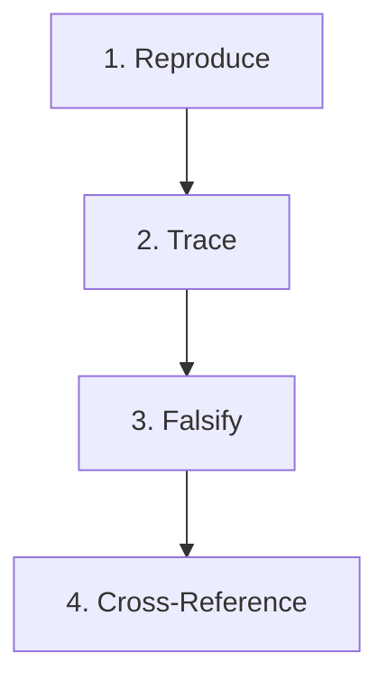

# 🐛 Bug-Fixing & Debugging Discipline Skill

This skill defines the mandatory workflow and strict mental discipline for diagnosing, tracing, and resolving bugs in this repository. All developer agents must follow these rules before modifying any codebase source files.

---

## 🛡️ The 4-Step Debugging Discipline

When a bug or unexpected behavior is detected, **do not write any code changes immediately**. You must follow this strict 4-step debugging workflow without exception:

### 1. 🧪 Reproduce (ทำให้บั๊กเกิดซ้ำได้ก่อน)
Before attempting any fix or forming a final hypothesis, you **MUST** create a reliable environment, script, or unit test that can **reproduce the bug consistently (Reliable Repro)**.
* *Plain Language:* **"Make the bug reproducible first."**
* If you cannot consistently reproduce the failure, you do not yet understand the problem. Do not make code modifications under guesswork.

### 2. 🔍 Trace (ตามรอยมัน)
Trace the exact flow of data from its origin (Input) through code executions, database states, and configuration flags, all the way to the point of failure (Output). Use tools such as Pino structured `logger` logs, stack traces, debugger tools, or telemetry events.
* *Plain Language:* **"Trace its steps."**
* Pinpoint the exact "deviation point" where the state or data diverges from the expected behavior.

### 3. ⚖️ Falsify (พิสูจน์ว่าทฤษฎีตัวเองผิด)
When you form a hypothesis about the root cause (e.g., "The bug is caused by component A"), you must try to prove your own theory **wrong** rather than proving it right. Build edge cases, mock conditions, or write assertion tests that specifically attempt to **disprove and falsify your theory**.
* *Plain Language:* **"Prove your own theory wrong (not right)."**
* This crucial scientific step prevents *Confirmation Bias* (the tendency to only see facts that support your assumption) and uncovers hidden edge cases or hidden state changes.

### 4. 📇 Cross-Reference (เช็คทุก breadcrumb ที่เจอ)
Whenever you discover a lead, stack trace line, error block, or minor bug (a "breadcrumb"), inspect related documentation, service configurations, API specs, database indices, and other modules.
* *Plain Language:* **"Check every breadcrumb encountered."**
* Do not perform isolated patches. Ensure you understand how the fix affects other components, and verify if the same pattern exists and needs fixing in other parts of the repository.
